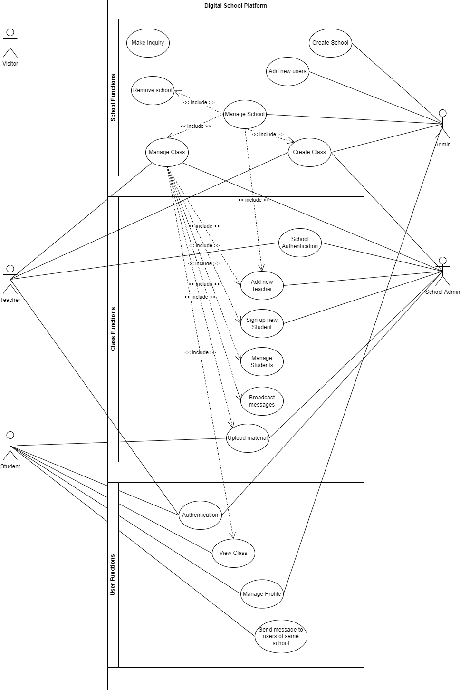
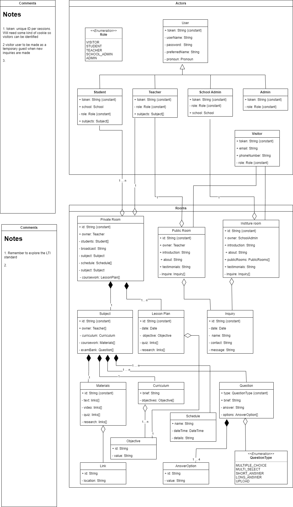

# music-academy-docs
SE 673 | Project Documentation for a Digital Music Academy 

## Project Description
 
The pandemic demonstrated the potential of using digital services for small businesses. It showed that with the right customization, digital services for local services can be beneficial to their clients. 
 
Take for example freelance teachers/tutors. Specifically focusing on music teaching. 
 
Most music teachers either have their own teaching business or supplement their primary income with teaching services. These businesses usually serve a local area and the services from different teachers tend to be from a broad range of subjects. Some teachers offer music education in more than one instrument, while others are specialists in a specific form of music or musical instrument. Their fees also vary depending on demand, student skill level, and fixed costs. 
 
Some teachers prescribe a syllabus to work from for a structured approach to learning, usually an affiliated board. Students learn music theory, music history along-side their lessons on their instrument of choice. The aforementioned schools also hold routine exams to target completion of curriculum. Performance exams are held with external examiners certified by one of the schools. However, these aren't mandatory. A significant number of students are learning for fun and opt of these set patterns. 
 
The generic product aims to help freelance teachers and students by providing them with a digital interface. Teachers would be able to create a public board advertising their services and have a separate student only space that would cater to their student body. The students should be able to see messages, lesson summaries, recorded classes (if any), and progress reports. 
 
The product should be customizable depending on the services type. Depending on the affiliation, curriculum-based lessons plans should be pre-populated. More broadly, the product should have the ability to group teachers together to create institutions.
 
## Features:

1.	Public site for advertising services.
2.	Student portal to view lessons, access learning material, scheduling, and history.
3.	Social space to interact with other students - This would have custom features to upload work/performances/ session.
4.	Ability for teachers to upload content tailored to each student, moderate content, grade performances.
5.	Ability for teachers to broadcast internal messages, livestream classes.
6.	Ability to group teachers together to create larger institutions.

## Software Design Document

### Use Case Diagram

### UML Class Diagram

### Sequence diagram

  
 #### Authentication flow 

 

